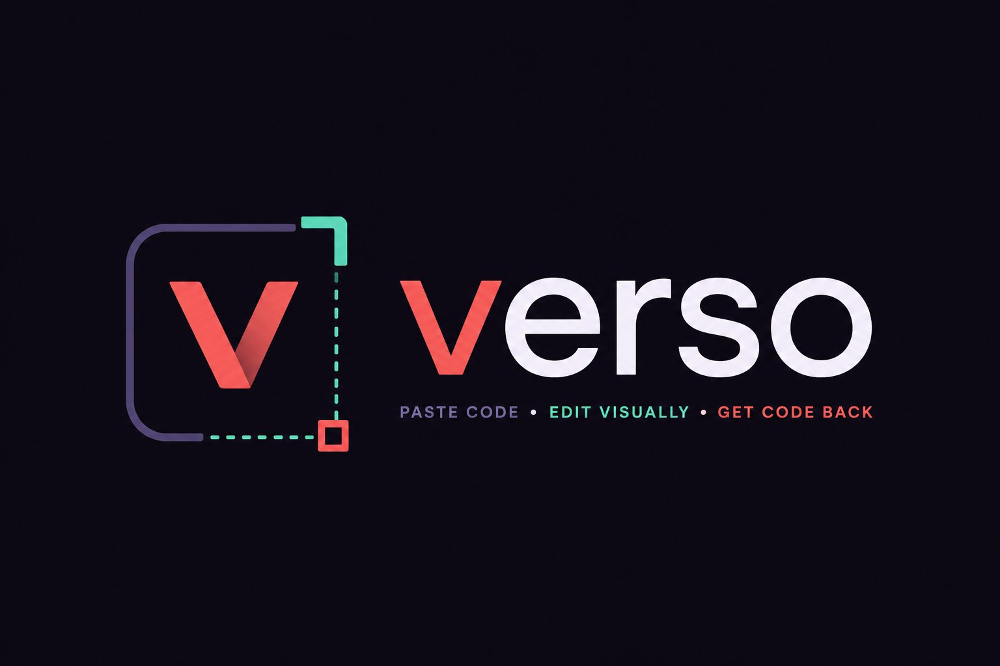

<p align="center">
  
</p>

<h1 align="center">Verso</h1>

**Paste your HTML/CSS, edit it visually, get clean code back.**

Verso is a single-file, zero-dependency visual editor for HTML/CSS that you bring your
own code to. Open your page in a live preview, then click to select, drag to move,
resize, rotate, change fonts and colors, swap images — and the code updates as you go.
Open a file, edit, download. That's it.

> No build step. No framework. No account. One HTML file you can open from disk.

## Live demo

Enable **GitHub Pages** (Settings → Pages → Source: *GitHub Actions*) and the included
workflow publishes it to:

```
https://sushipl-coder.github.io/verso/
```

Or just open `index.html` in any modern browser.

> **Tip:** set `assets/baner.png` as the repo's social preview in
> *Settings → General → Social preview* so the banner shows when the link is shared.

## Why this exists

Visual web editors are either heavy proprietary SaaS (Webflow, Framer, builder.io) or
locked into a framework. There was no small, MIT-licensed, *bring-your-own-code* tool
that round-trips edits straight back to plain HTML. Verso is that tool. It doesn't
imitate or repackage anyone — it's a focused utility built on plain DOM manipulation and
serialization.

## Features

- **Open / Download** real `.html` files (or drag & drop them onto the canvas).
- **Click to select** any element, with a parent breadcrumb to walk up the tree.
- **Drag to move**, **8 resize handles** (corners + edges, shrink or grow from any side, aspect lock), **circle handle to rotate** — directly on the preview. Exact **width/height in px** in the panel.
- **Copy / paste / duplicate** elements (`Ctrl+C` / `Ctrl+V` / `Ctrl+D`).
- **Typography:** font family, size, weight, italic, alignment, line-height, letter-spacing, text color.
- **Box:** background, border (width / style / color), corner radius, opacity, padding, margin.
- **Double-click to edit text** in place.
- **Named asset slots** (e.g. `hero.mp4`, `photo.jpg`): the preview can use an uploaded file or a labelled placeholder, while the exported code keeps the clean filename. Drop an image straight onto an existing picture to swap it.
- **Zoom** and **collapsible side panel** for small screens.
- **Undo / redo** (`Ctrl+Z` / `Ctrl+Shift+Z`, or the toolbar buttons).
- Keyboard: `Esc` deselect, `Delete` remove selected element.

## How it works

The pasted page is rendered in a same-origin `<iframe>`. Edits are written as inline
styles/attributes directly on the elements, then the code panel is produced by
serializing that DOM and cleaning out the editor's internal markers. Asset references are
restored to their plain filenames on export.

This is a deliberate, robust design choice — see *Limitations*.

## Limitations (honest)

- **Exported HTML is re-formatted** (indented and normalized), not a surgical patch of
  your original source. Comments and custom whitespace are not preserved.
- **Edits are applied as inline styles** that override your `<style>` rules. Verso does
  not (yet) edit CSS rules in `<style>` or external sheets.
- Transform/footprint handles assume normal document flow; very exotic layouts may behave
  unexpectedly.

## Roadmap

- Editing CSS **rules** in `<style>` instead of inline overrides.
- Source-preserving export (parser with source-position mapping).
- Resize from any edge/corner; alignment guides.

## Development

Verso is a single static file — there is nothing to build. To serve it locally:

```bash
npx serve .
# or just open index.html
```

## Contributing

Issues and pull requests are welcome. Keep the project dependency-free and the app a
single self-contained `index.html`. See [CONTRIBUTING.md](CONTRIBUTING.md).

## License

[MIT](LICENSE) © SushiPL-coder
